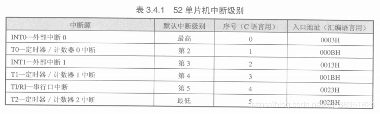

# Singlechip
## 在KEIL中创建一个工程
   - project <br/> 
   --> New uVision Project <br/> 
   --> 设置保存路径和工程名 <br/> 
   --> 选择单片机的类型（51：Atmel->AT89C51）<br/> 
   --> 确定后会弹出一个窗口询问是否将8051的启动代码复制到项目文件夹并将文件添加到项目，选否 <br/> 
   --> 创建一个C文件 <br/> 
   --> 并将这个C文件添加到源组中（右击源组，选中“Add files to Group'Source Group'”） <br/> 
   --> 运行C程序，生成 .hex 文件（点击上方图表"target options" -> output -> 勾选"Greate HEX"）<br/>
## reg52.h头文件的作用
   - 在代码中引用头文件，其实际意义是将头文件中的所用内容都放到引用头文件的地方
   - 下面是reg52.h头文件的内容：
   ```
   /*--------------------------------------------------------------------------
REG52.H

Header file for generic 80C52 and 80C32 microcontroller.
Copyright (c) 1988-2002 Keil Elektronik GmbH and Keil Software, Inc.
All rights reserved.
--------------------------------------------------------------------------*/

#ifndef __REG52_H__
#define __REG52_H__

/*  BYTE Registers  */
sfr P0    = 0x80;
sfr P1    = 0x90;
sfr P2    = 0xA0;
sfr P3    = 0xB0;
sfr PSW   = 0xD0;
sfr ACC   = 0xE0;
sfr B     = 0xF0;
sfr SP    = 0x81;
sfr DPL   = 0x82;
sfr DPH   = 0x83;
sfr PCON  = 0x87;
sfr TCON  = 0x88;
sfr TMOD  = 0x89;
sfr TL0   = 0x8A;
sfr TL1   = 0x8B;
sfr TH0   = 0x8C;
sfr TH1   = 0x8D;
sfr IE    = 0xA8;
sfr IP    = 0xB8;
sfr SCON  = 0x98;
sfr SBUF  = 0x99;

/*  8052 Extensions  */
sfr T2CON  = 0xC8;
sfr RCAP2L = 0xCA;
sfr RCAP2H = 0xCB;
sfr TL2    = 0xCC;
sfr TH2    = 0xCD;


/*  BIT Registers  */
/*  PSW  */
sbit CY    = PSW^7;
sbit AC    = PSW^6;
sbit F0    = PSW^5;
sbit RS1   = PSW^4;
sbit RS0   = PSW^3;
sbit OV    = PSW^2;
sbit P     = PSW^0; //8052 only

/*  TCON  */
sbit TF1   = TCON^7;
sbit TR1   = TCON^6;
sbit TF0   = TCON^5;
sbit TR0   = TCON^4;
sbit IE1   = TCON^3;
sbit IT1   = TCON^2;
sbit IE0   = TCON^1;
sbit IT0   = TCON^0;

/*  IE  */
sbit EA    = IE^7;
sbit ET2   = IE^5; //8052 only
sbit ES    = IE^4;
sbit ET1   = IE^3;
sbit EX1   = IE^2;
sbit ET0   = IE^1;
sbit EX0   = IE^0;

/*  IP  */
sbit PT2   = IP^5;
sbit PS    = IP^4;
sbit PT1   = IP^3;
sbit PX1   = IP^2;
sbit PT0   = IP^1;
sbit PX0   = IP^0;

/*  P3  */
sbit RD    = P3^7;
sbit WR    = P3^6;
sbit T1    = P3^5;
sbit T0    = P3^4;
sbit INT1  = P3^3;
sbit INT0  = P3^2;
sbit TXD   = P3^1;
sbit RXD   = P3^0;

/*  SCON  */
sbit SM0   = SCON^7;
sbit SM1   = SCON^6;
sbit SM2   = SCON^5;
sbit REN   = SCON^4;
sbit TB8   = SCON^3;
sbit RB8   = SCON^2;
sbit TI    = SCON^1;
sbit RI    = SCON^0;

/*  P1  */
sbit T2EX  = P1^1; // 8052 only
sbit T2    = P1^0; // 8052 only
             
/*  T2CON  */
sbit TF2    = T2CON^7;
sbit EXF2   = T2CON^6;
sbit RCLK   = T2CON^5;
sbit TCLK   = T2CON^4;
sbit EXEN2  = T2CON^3;
sbit TR2    = T2CON^2;
sbit C_T2   = T2CON^1;
sbit CP_RL2 = T2CON^0;

#endif
   ```
## 点亮一个LED
```
#include<reg52.h>
//声明管脚
sbit led=P0^0;
void main(){
	while(1){
		led=1;
	}	
}
```
## 延时函数
```
	#define uint unsigned int
	void delayms(uint xms){
		uint i, j;
		for(i=xms;i>0;i--)		//延时xms毫秒（ms）
			for(j=110;j>0;j--);
	}
```
## 
## LED流水灯
   - C语言常用预处理命令 **宏定义#define使用：#define 新名称  原内容（不加分号）**//对同一个内容，宏定义只能定义一次
   - 循环左移和右移函数,包含在instrins.h库函数里边：
      - _crol_(a, b); 循环左移函数，a是要左移的值，b是左移的位数
      - _cror_(a, b); 循环右移函数，a是要右移的值，b是右移的位数
   - 实现代码
      - 方法1：
      ```
	#include<reg52.h>
	#define uint unsigned int
	#define A P0

	void delay(uint i){
		while(i--);
	}

	void main(){
		uint i;
		A=0x01; //是最低位的发光二极管亮
		delay(50000);
		while(1){
			for(i=0;i<8;i++){
				A=(0x01<<i); //0x01:0000 0001 左移一位得到 0000 0010
				delay(50000);
			}
		}
	}
	```
      - 方法2：
```
#include<reg52.h>
#define uint unsigned int //宏定义
sbit led1=P0^0;
sbit led2=P0^1;
sbit led3=P0^2;
sbit led4=P0^3;
sbit led5=P0^4;
sbit led6=P0^5;
sbit led7=P0^6;
sbit led8=P0^7;
//声明延时函数
void delayms(uint);
void main()
{
	while(1)
	{
		led1=1;
		delayms(500);
		led1=0;
		led2=1;
		delayms(500);
		led2=0;
		led3=1;
		delayms(500);
		led3=0;
		led4=1;
		delayms(500);
		led4=0;
		led5=1;
		delayms(500);
		led5=0;
		led6=1;
		delayms(500);
		led6=0;
		led7=1;
		delayms(500);
		led7=0;
		led8=1;
		delayms(500);
		led8=0;
	}
	}
	//延时函数
	void delayms(uint xms)
	{
		uint i,j;
		for(i=xms;i>0;i--)
			for(j=110;j>0;j--);
	}
   ```
## 蜂鸣器
   - 在单片机上大都是使用蜂鸣器来做提示或报警；
   - 改变单片机引脚输出波形的频率，就可以调整控制蜂鸣器音调，产生不同的音色和音调
   - 改变输出电平的高低电平占空比，则可控制蜂鸣器声音的大小
   ```
   	#include<reg52.h>
	#define uint unsigned int

	sbit beep=P1^5;
	//延时函数
	void delay(uint i){
		while(i--);
	}
	void main(){
		while(1){
			beep=1;
			delay(1000);  //延时时间越短输出的音频信号频率越高，音调越高
			beep=0;
			delay(1000);
		}	
	}
   ```

## 继电器（relay）
   - 继电器（英文名称：relay）是一种电控制器件，是当输入量（激励量）的变化达到规定要求时，在电气输出电路中使被控量发生预定的阶跃变化的一种电器。它**具有控制系统（又称输入回路）和被控制系统（又称输出回路）之间的互动关系**。通常应用于自动化的控制电路中，它**实际上是用小电流去控制大电流运作的一种“自动开关”**。故在电路中起着自动调节、安全保护、转换电路等作用。
   - 继电器内部含有线圈和触电，当线圈的电就会使触电吸合，从而使得开关连通
  ```
     #include<reg52.h>
     #define uint unsigned int
     sbit relay=P1^4;
     void main(){
	  relay=0;  //
	  while(1)
	  {	
	  }
     }
  ```

## 数码管
   - 一个数码管的引脚是10个，显示8字需要7小段，另外还有一个小数点，最后还有一个公共端，生产商为了封装统一，单位数码管都封装10个引脚，其中第3脚和第8脚是连接在一起的
   
   - 又由公共端可分为共阴极和共阳极
      - 共阴极数码管：发光二极管的阴极全部连接在一起，通常设计电路时将阴极接地；当我们给数码管的任一个阳极加高电平，对应的这个发光二极管就点亮了
      - 共阳极数码管：发光二极管的阳极全部连接在一起，通常设计电路时将阳极接高电平；当我们给数码管的任一个阴极加低电平，对应的这个发光二极管就点亮了
   - 用万用表检测数码管的引脚排列
      - 将数字万用表置于二极管挡，红表笔接在1脚，然后用黑表笔去接触其他各引脚，假设只有当接触到9脚时，数码管的a段发光，而接触其余引脚时则不发光。由此可知，被测数码管为共阴极结构类型，9脚是公共阴极，1脚则是数码管的a段。接下来再检测各段引脚，仍使用数字万用表二极管挡，将黑表笔固定接在9脚，用红表笔依次接2~10引脚时，数码管的其他段先后分别发光，据此便可绘出该数码管的内部结构和引脚排列图。而共阳极需将红、黑表笔对调。
	
### 数码管静态显示
   - 当多位数码管应用于某一系统时，它们的＂位选“是可独立控制的，而“段选“是连接在一起的，我们可以通过位选信号控制哪几个数码管亮，而在同一时刻，位选选通的所有数码管上显示的数字始终都是一样的，因为它们的段选是连接在一起的，所以送入所有数码管的段选信号都是相同的，那么它们显示的数字必定一样，数码管的这种显示方法叫做静态显示
   
      - 在查看原理图时，**原理图中标号相同的节点，在实际电路中是物理电气相连的**,最上面一排是6个单位数码管，可以看到所有数码管的阳极，即标有a,b,c,d,e,f,g,h的引脚全部连接在一起，然后与下面的U1元件73HC573锁存器的数据输出端相连，锁存器的数据输入端连接单片机的P0口，P0口同时加了上拉电阻。数码管中WEl,WE2,WE3,WE4,WE5,WE6是它们的位选端，每一个数码对应一个位选端，与下面U2元件74HC573的数据输出端的低6位相连，U2的数据输入端也连接到单片机的P0口。两个锁存器的锁存端分别与单片机的P2.6和P2.7相连
      - 共阴极：
      ```
      	#include <reg52.h>         //52系列单片机头文件
	sbit dula = P2^6;		   //申明U1锁存器的锁存端
	sbit wela = P2^7;		   //申明U2锁存器的锁存端
	void main()			  //主函数
	{
    		wela=1;	      //打开U2锁存器
    		P0=0xFE	;	      //送入位选信号
    		wela=0;		  //关闭U2锁存器

    		dula=1;	      //打开U1锁存器
    		P0=0x7F	;	      //送入段选信号
    		dula=0;		  //关闭U1锁存器
		while(1);		  //程序停止到这里
  	}
      ```
 - 共阳极：

      ```
      	#include <reg52.h>         //52系列单片机头文件
	sbit dula = P2^5;		   //申明U1锁存器的锁存端
	sbit wela = P2^6;		   //申明U2锁存器的锁存端
	void main()			  //主函数
	{
   		wela=1;	      //打开U2锁存器
    		P0=0x01	;	      //送入位选信号
    		wela=0;		  //关闭U2锁存器

    		dula=1;	      //打开U1锁存器
    		P0=0x80	;	      //送入段选信号
    		dula=0;		  //关闭U1锁存器
		while(1);		  //程序停止到这里
  	}				
      ```
     - 可选择数码管哪位
     ```
     #include<reg52.h>
     #define uint unsigned int 
     #define uchar unsigned char
     sbit dula=P2^6;
     sbit wela=P2^7;
     sbit HC138A = P2^0;
     sbit HC138B = P2^1;
     sbit HC138C = P2^2;
     uchar num;
     void delayms(uint xms){
	uint i,j;
	for(i=xms;i>0;i--)
		for(j=110;j>0;j--);
	}
	uchar code table[]={
	0x3f, 0x06, 0x5b, 0x4f,
	0x66, 0x6d, 0x7d, 0x07,
	0x7f, 0x6f, 0x77, 0x7c, 
	0x39, 0x5e, 0x79, 0x71};
	void main(){
		wela=1;  	//打开U2锁存端
		HC138A = 1;
		HC138B = 0;
		HC138C = 0;   //送入位选信号，低电平有效
		wela=0;
		while(1){
			for(num=0;num<16;num++){	  //16个数循环显示
				dula=1;		//打开U1锁存端
				P0=table[num];
				dula=0;
				delayms(1500);
			}
		}
	}
     ```
     - 共阴极数码管编号：
     
### 数码管动态显示
   - 使六个共阴极数码管一次显示1~6：
```

```
   - 数码管的动态显示又称为数码管的动态扫描显示,即轮流向各位数码管送出字形码和相应的位选，利用发光二极管的余辉和人眼视觉的暂留作用，使人感觉各位数码管在同时显示
### 中断概念
   - 51单片机内部一共有5个中断源，即有5种情况发生时，会使单片机去处理中断程序
   - 52单片机内部一共有6个中断源
      - INT0— 外部中断 0, 由 P3.2 端口线引入， 低电平或下降沿引起。<br/>
      	INT1— 外部中断 1, 由 P3.3 端口线引入， 低电平或下降沿引起。<br/>
        T0一定时器／计数器 0 中断， 由T0 计数器计满回零引起。<br/><br/>
        T1一定时器／计数器 1 中断， 由 T1 计数器计满回零引起。<br/><br/>
        T2一定时器／计数器 2 中断， 由 T2 计数器计满回零引起。<br/>
        TI/ RI—串行口中断， 串行端口完成一帧字符发送／接收后引起。<br/>


   - 中断嵌套
      - 若单片机正在处理一个中断程序时，又有另一个中断发生，单片机会停止当前的中断程序，而转去处理新的中断程序，新中断程序处理完后再回到刚刚停止的中断程序处继续执行，而后再返回主程序处继续执行

   - 中断优先级
      - 当同时有两个中断出现，单片机会先去处理中断优先级高的中断


### 单片机的定时器中断
   - **单片机51单片机内部共有两个16位可编程的定时器／计数器，即定时器T0和定时器T1。52单片机内部多一个T2定时器／计数器**。它们既有定时功能又有计数功能，通过设置与它们相关的特殊功能寄存器可以选择启用定时功能或计数功能。需要注意的是，这个定时器系统是单片机内部一个独立的硬件部分，它与CPU和晶振通过内部某些控制线连接并相互作用，**CPU一旦设置开启定时功能后，定时器便在晶振的作用下自动开始计时，当定时器的计数器计满后，会产生中断**，即通知CPU该如何处理。
   - 知识点：中断服务程序的写法
C51的中断函数格式如下：

void 函数名()interrupt 中断号 using 工作组
{
       中断服务程序内容
｝
       中断函数不能返回任何值，所以最前面用void;后面紧跟函数名，名字可以随便起，但不要与C语言中的关键字相同；中断函数不带任何参数，所以函数名后面的小括号内为空；**中断号是指单片机中几个中断源的序号**，请查看3.4节讲解中断时的表3.4.1。这个序号是编译器识别不同中断的唯一符号，因此在写中断服务程序时务必要写正确；最后面的"using工作组”是指这个中断函数使用单片机内存中4组工作寄存器中的哪一组，C51编译器在编译程序时会自动分配工作组，因此最后这句话我们通常省略不写，但大家以后若遇到这样的程序代码时要知道是什么意思。一个简单中断服务程序写法如下：
	voidT1_time()interrupt3
	｛
       		TH1=(65536-10000)/256;
       		TL1=(65536-10000)%256;
	｝
       上面这个代码是一个定时器1的中断服务程序，定时器1的中断序号是3,因此我们要写成interrupt3,服务程序的内容是给两个初值寄存器装入新值。
       在写单片机的定时器程序时，在程序开始处需要对定时器及中断寄存器做初始化设置，通常定时器初始化过程如下：
       ① 对TMOD赋值，以确定T0和T1的工作方式。
       ② 计算初值，并将初值写入TH0、TL0或TH1、TL1。
       ③ 中断方式时，则对IE赋值，开放中断。
       ④ 使TR0或TR1置位，启动定时器／计数器定时或计数。


